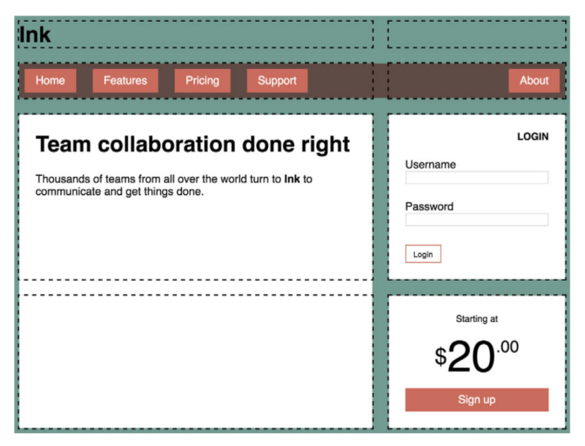

Assignment 2A-2

## Objective
Our goal for this assignment is to create a web page layout using grid and flexbox layout. 

In this repository you'll find a base HTML file that contains the starter code for this assignment

## Requirements
Use the starter code provided and add a CSS stylesheet. You may modify the HTML, though you should not need to add any additional HTML elements.
* ### Grid properties
    * Your final must create the grid outlined in the target (example) image.
    * You may use any grid properties you wish.
    * You will need to make use of flexbox as well.

* ### General CSS requirements
    * Don't overload individual rulesets - keep your CSS code concise and precise.
    * Consider naming conventions for classes and IDs carefully 
    * Keep selector specificity as low as possible! 